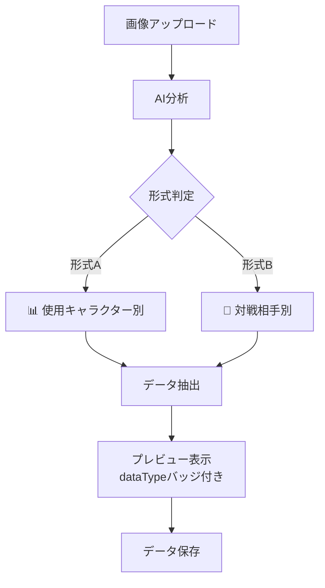

# 🎯 データタイプ判定機能の追加 - 実装完了

## 📋 概要

AIが画像分析時にどちらのデータ形式と判定したかを明示的に出力する機能を追加しました。

---

## ✨ 新機能

### 📊 データタイプの識別

画像分析の出力に`dataType`フィールドが追加され、以下の2つの形式を明確に区別できるようになりました:

#### **1. 使用キャラクター別成績** (`player_characters`)
```json
{
  "dataType": "player_characters",
  "matches": [
    {"character": "ALL", "totalMatches": 23, "winRate": 60.87, "wins": 14},
    {"character": "LUKE", "totalMatches": 23, "winRate": 60.87, "wins": 14}
  ]
}
```

#### **2. 対戦相手別成績** (`opponent_characters`)
```json
{
  "dataType": "opponent_characters",
  "matches": [
    {"character": "KIMBERLY", "totalMatches": 33, "winRate": 54.55, "wins": 18},
    {"character": "ZANGIEF", "totalMatches": 33, "winRate": 69.70, "wins": 23}
  ]
}
```

---

## 🎨 UI改善

### データタイプバッジ

プレビュー画面に視覚的に目立つバッジを表示:

```
┌─────────────────────────────────────┐
│ 📊 使用キャラクター別成績            │  ← 紫グラデーション
└─────────────────────────────────────┘

┌─────────────────────────────────────┐
│ 🎯 対戦相手別成績                    │  ← ピンクグラデーション
└─────────────────────────────────────┘
```

### カラースキーム

| データ形式 | アイコン | カラー | グラデーション |
|-----------|---------|--------|---------------|
| 使用キャラクター | 📊 | 紫 | #667eea → #764ba2 |
| 対戦相手 | 🎯 | ピンク | #f093fb → #f5576c |
| 不明 | ❓ | グレー | #a8a8a8 → #636363 |

---

## 🔧 技術的な変更

### 1. `gemini-service.js`

#### プロンプトの更新
```javascript
// 出力形式に dataType を追加
{
  "dataType": "player_characters" または "opponent_characters",
  "matches": [...]
}
```

#### レスポンス処理の強化
```javascript
// dataTypeの検証
const dataType = parsedData.dataType || 'unknown';
const validDataTypes = ['player_characters', 'opponent_characters'];
if (!validDataTypes.includes(dataType)) {
    console.warn('⚠️ 不明なdataType:', dataType);
}

// 戻り値に dataType を含める
return {
    dataType: dataType,
    matches: validatedMatches,
    rawResponse: aiResponse,
    usage: data.usageMetadata || {}
};
```

### 2. `app.js`

#### データ保存の拡張
```javascript
// dataTypeも保存
this.batchDataType = result.dataType || 'unknown';
```

#### プレビュー表示の改善
```javascript
displayBatchDataPreview(matches, dataType = 'unknown') {
    // データタイプヘッダーを追加
    const dataTypeLabel = dataType === 'player_characters' 
        ? '📊 使用キャラクター別成績' 
        : dataType === 'opponent_characters' 
        ? '🎯 対戦相手別成績' 
        : '❓ 形式不明';
    // ...
}
```

### 3. `styles.css`

#### 新しいスタイル
```css
.data-type-badge {
  display: inline-flex;
  align-items: center;
  gap: var(--spacing-xs);
  padding: var(--spacing-sm) var(--spacing-md);
  border-radius: 20px;
  font-weight: 600;
}

.data-type-badge.player-data {
  background: linear-gradient(135deg, #667eea 0%, #764ba2 100%);
  box-shadow: 0 4px 15px rgba(102, 126, 234, 0.3);
}

.data-type-badge.opponent-data {
  background: linear-gradient(135deg, #f093fb 0%, #f5576c 100%);
  box-shadow: 0 4px 15px rgba(245, 87, 108, 0.3);
}
```

---

## 📊 使用例

### ワークフロー



---

## 🎯 メリット

### 1. **明確性の向上**
- AIの判定結果が一目で理解できる
- データの種類を視覚的に識別

### 2. **デバッグの容易化**
- エラー時に判定ミスを即座に特定
- ログに判定結果が記録される

### 3. **データ処理の最適化**
- 形式に応じた適切な処理が可能
- 将来的な機能拡張の基盤

### 4. **ユーザビリティ**
- 直感的なUI
- 誤認識を防ぐ視覚的フィードバック

---

## 🧪 テスト方法

### 1. 使用キャラクター別成績のテスト
```bash
1. アプリを開く
2. 「まとめて入力」セクションへ移動
3. `使用キャラクター別成績.png`をアップロード
4. 確認: 
   ✓ 紫色のバッジ「📊 使用キャラクター別成績」が表示
   ✓ コンソールに "dataType": "player_characters" が出力
```

### 2. 対戦相手別成績のテスト
```bash
1. `対戦相手別成績.png`をアップロード
2. 確認:
   ✓ ピンク色のバッジ「🎯 対戦相手別成績」が表示
   ✓ コンソールに "dataType": "opponent_characters" が出力
```

---

## 📝 今後の展開

### 潜在的な活用方法

1. **データ保存時の区別**
   - 使用キャラクターと対戦相手を別々のカテゴリで管理

2. **統計分析の精緻化**
   - データタイプに応じた異なる分析手法

3. **エラーハンドリング**
   - 判定が不明な場合の特別処理

4. **ユーザーフィードバック**
   - 判定が間違っている場合の修正機能

---

## 🎉 コミット情報

- **コミットハッシュ**: `db178ad`
- **変更ファイル**: 3ファイル
- **追加**: 85行
- **削除**: 5行

---

## 📚 関連ドキュメント

- [実装完了報告](IMPLEMENTATION_REPORT.md)
- [テストチェックリスト](TESTING_CHECKLIST.md)
- プロンプト改善履歴:
  - `8c02ab2`: 初期プロンプト強化
  - `2a02988`: プロンプト簡潔化
  - `db178ad`: データタイプ判定追加

---

**実装日**: 2025年10月10日  
**ステータス**: ✅ 完了、テスト準備完了
